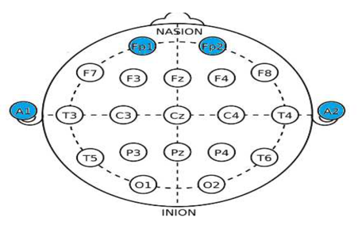
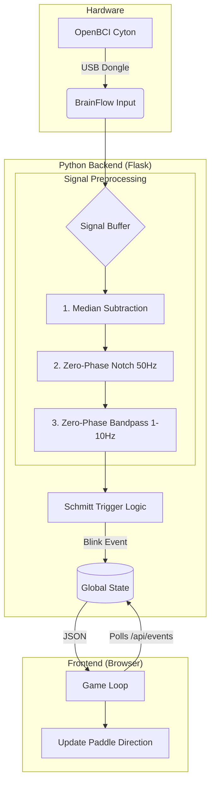
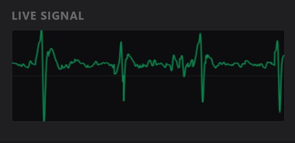
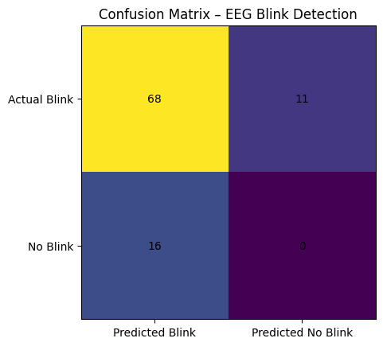

# EEG Blink-Controlled Pong Game

This repositors contains a real-time EEG-based Brain-Computer Interface (BCI) appliction in the form of a classic Pong game, where the user can control the paddle using eye blinks. The eye blinks are detected from the EEG (Electroencephalogram) signal and act as direction changes of the paddle. This application was developed in the context of ZHAW ACLS Track module 1.

If you are only interested in setting up and running the application move directly to Section 12.

---

## 1. Project Motivation & Goal

Eye blinks are a natural human action and produce strong **electro-oculographic (EOG)** artifacts in an EEG signal that can be used for blink detection.

**Objective:**

- Build a *blink-controlled Pong game*.
- Account for variability between users.
- Provide real-time feedback and quantitave performance metrics.

The project focuses on robust and efficient threshold-based detection, rather than complex machine-learning methods, to achieve fast response time. 

---

## 2. Physiological Background

**EEG General:**

- EEG is a non-invasive measurement of the electric fields in the brain.
- Electrodes on the skin record voltage potentials.
- Large neuron populations must be active simultaneously for EEG to be detected successfully.
- There are several noise factors, such as powerlines, environmental distractions or movement of the user.

**EEG in the context of blink detection:**

- Eye blinks are **low-frequency signals (<10 Hz)** that appear as sharp peaks.
- Brain activity mostly involves higher frequency signals (e.g., gamma waves > 30 Hz).
- Eye blinks are best detected from the forehead.
- Blinks produce EOG signals rather than EEG signals.

The EOG spikes that are created from eye blinks stem from the fact that the human eye acts as a dipole, with the cornea as a positive pole and the retina as a negative pole. When humans blink, the eyeballs rotate and a big voltage spike is induced that *travels* over the forehead, eventually causing an EOG artifact in the EEG signal. This eyeball rotation is referred to as "Bell's phenomenon". 

Since the EOG artifact travels over the forehead, it is best detected from the two frontal electrodes on the forehead, while the electrodes on the ears act as groundings (see Figure 1).

Figure 1. Electrode positions (Deepu et al., 2024).

Since baseline brain activity ist often rhythmic, the blink artifacts show up as sharp peaks that can be identified well.

## 3. Challenges

Challenges in the implementation of the blink-controlled Pong game included:

- Various sources of noise such as environmental noise and user movement.
- Blinking induces a sharp peak in the signal that was often detected as two blinks in the early development stages.
- There is a big variability between different persons in the amplitude of blink-peaks, probably due to skin impedence.

## 4. System Architecture 

The application runs as a Flask web application with a live dashboard, calibration method, canvas for the pong game and a signal livestream. 

## 5. Hardware & Signal acquisition

### EEG Hardware
- Board: [OpenBCI Cyton](https://shop.openbci.com/products/cyton-biosensing-board-8-channel?srsltid=AfmBOooN6hv27T8yB-AuJwkspXaoyc0rhKdvJzw4dE2Ysw9Sf9euZul0)
- Sampling Rate: 250 Hz
- Electrodes: Two frontal channels (forehead)
- Headset: [OpenBCI Ultracortex headset](https://shop.openbci.com/products/ultracortex-mark-iv)

### Signal Acquisition

- Continuous streaming via [BrainFlow Python Library](https://brainflow.org/).
- Two frontal forehead channels are averaged to increase SNR (Signal-to-Noise Ratio).
- Data is buffered in sliding windows for stable filtering.

---

## 6. Signal Pre-Processing

All signal processing steps are  implemented using *numpy* and *scipy.signal*.

### 6.1 DC Offset Removal

EEG signals often contain a gradual baseline drift due to electrode-skin impedence, making the signal shift over time.

**Method:**
- Subtract the median of the signal window.
- Centers the signal around zero.

### 6.2 Notch Filter

- Removes main interference from powerlines.
- 50 Hz (Eu) or 60 Hz (US).
- Implemented using an IIR notch filter.

Powerlines in the Europe work at 50 Hz and can interfere with the EEG measurements. Hence this frequency should be removed. 

### 6.3 Band-Pass Filter (Signal Isolation)

- 1-10 Hz band-pass filter.
- Isolates the signal to focus on blink-related activity, maximizing SNR.
- Suppresses muscle artifacts and higher frequency signal components such as brain activity.

### 6.4 Zero-Phase Implementation

Critical for real-time gaming is low latency. This was ensured by applying all filters using `scipy.signal.filtfilt` (forward-backward filtering). This avoids phase distortion. Normal filters shift the signal in time and create lag, while zero-phase filtering ensures that the peak of the blink aligns with the actual blink. 

---

## 7. Blink Detection Logic

### 7.1 Detection Principle

- Blinks appear as large amplitude peaks in the filtered signal (see Figure 2).
- Detection is based on an absolute amplitude threshold.
- A blink is triggered once the signal exceeds a defined threshold.

Figure 2. Example of the live streamed signal in the Flask app, showing blink peaks.

### 7.2 Schmitt-Trigger Logic

To avoid double blink triggers, a two-threshold logic is used:

- **BLINK-ON:**
    - |signal| > threshold

### 7.3 Cooldown Mechanism

## 8. Calibration Procedure

To account for the inter-user variability a calibration procedure was implemented that guides the user through calibration:

1. User relaxes (baseline is captured)
2. User blinks on visual cues (green light)
3. Process repeated several times
4. Calibration is finished once the light stays green

Based on the calibration a threshold is estimated as: $threshold = noise\_mean + 0.6 * (blink\_mean - noise\_mean)$

In words, the threshold to trigger a blink is equal to the baseline (or noise) plus 60% of the blink peaks.

##  9. Game Integration (Pong)

The pong game is implemented in `app_v4_bp-filter.py`.

- Every blink triggers a direction change of the paddle.
- The paddle moves continuously until the next blink is detected.
- Multiple difficulty levels are implemented differing in paddle size, ball speed and paddle speed.
- Single-player mode (player against the wall) and two-player mode (EEG-player vs. keyboard player) are supported.

## 10. Quantitative Evaluation

A separate measurement interface for the evaluation of the algorithm was implemented in `detection_analysis.py`. The methodology and logic follow the exact same procedures as `app_v4_bp-filter.py`. However, this interface was used to measure how well the application can capture blinks of different users and does not include the pong game.

- 12 blink cues in 60 seconds
- Automatic counting of:
    - True Positives (TP)
    - False Positives (FP)
    - False Negatives (FN)
- Metrics:
    - Precision
    - Recall
    - F1-Score

No True Negatives were analyzed in this context. 

## 11. Results

Testing the application with seven participants (age 25-64) yielded the following scores:

- Mean Precision: 0.87
- Mean Recall: 0.81
- Mean F1-Score: 0.83

The evaluation showed, that blinks are clearly detectable, but performance depends on environment and user adaptation. Further, there can be seen a learning effect as users learn how to blink "correctly" for identification. 

Figure 3. Confusion Matrix of quantitative analysis.

## 12. Setup and Execution

1) Create and install the environment

`py -m venv .eeg`

`.\.eeg\Scripts\python.exe -m pip install --upgrade pip`

`.\.eeg\Scripts\python.exe -m pip install -r requirements.txt`

2) Run the app

`.\.eeg\Scripts\python.exe app_v3.py`

3) Open in browser

`http://localhost:5000`

## 13. References

Biasiucci, A., Franceschiello, B., & Murray, M. M. (2019). Electroencephalography. Current Biology, 29(3), R80–R85. https://doi.org/10.1016/j.cub.2018.11.052

Chandralekha, M., Jayadurga, N. P., Chen, T. M., Sathiyanarayanan, M., Saleem, K., & Orgun, M. A. (2025). A synergistic approach for enhanced eye blink detection using wavelet analysis, autoencoding and Crow-Search optimized k-NN algorithm. Scientific Reports, 15(1), 11949. https://doi.org/10.1038/s41598-025-95119-2

CUPIDO: An Analog Ultra-Low-Power and Contactless Eye Blink Detector for Smart Glasses. (n.d.). Retrieved 14 January 2026, from https://www.research-collection.ethz.ch/entities/publication/80ed2e65-a3ec-4769-afdf-994b5bb11d44

Deepu, S., Chithra, P., Panicker, P., Subodh, P., Binu, P., Dhanya, M., Anusree, V., Archana, M., & Athira, B. (2024). EEG-Based Eye Blink Detection and Interpretation for Human-Computer Interaction and Communication. 2024 International Conference on Brain Computer Interface & Healthcare Technologies (iCon-BCIHT), 263–267. https://doi.org/10.1109/iCon-BCIHT63907.2024.10882341

Oleksak, P., Novotny, M., Patocka, J., Nepovimova, E., Hort, J., Pavlik, J., Klimova, B., Valis, M., & Kuca, K. (2021). Neuropharmacology of Cevimeline and Muscarinic Drugs—Focus on Cognition and Neurodegeneration. International Journal of Molecular Sciences, 22(16), 8908. https://doi.org/10.3390/ijms22168908

The Complete Ultracortex. (n.d.). OpenBCI Shop. Retrieved 14 January 2026, from https://shop.openbci.com/products/the-complete-headset-eeg
